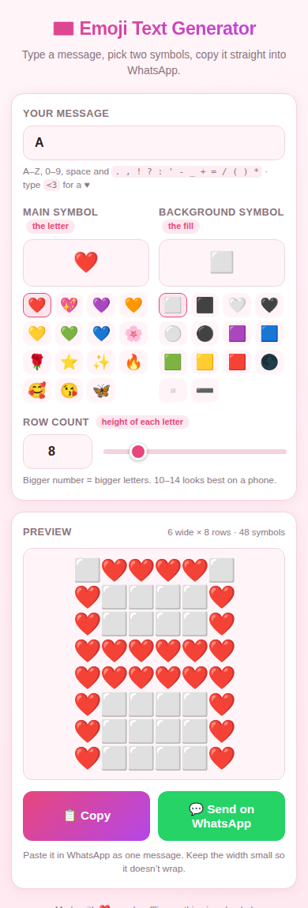

# 💌 Emoji Text Generator

Turn any short message into big block letters made of emoji, then copy it
straight into WhatsApp.

Plain **HTML + CSS + JavaScript**. No build step, no frameworks, no internet
needed once loaded — just open `index.html`.

<p align="center">
  
</p>

---

## What it does

You give it three things:

| Input | What it means | Example |
| --- | --- | --- |
| **Main symbol** | the emoji the letters are drawn with | ❤️ |
| **Background symbol** | the emoji that fills the empty space | ⬜ |
| **Row count** | how many emoji tall each letter is | `12` |

…plus your message, and it draws every letter as a block, **stacked
vertically** — one letter on top of the next.

Stacking is deliberate: WhatsApp on a phone only fits about 10–12 emoji per
line. Writing letters side by side would make a long message wrap and the
picture would fall apart. Stacked, the art stays ~9 emoji wide and always
looks right.

Then hit **📋 Copy** or **💬 Send on WhatsApp**.

### Example — `I <3 U` at row count 12

```
❤️❤️❤️❤️❤️❤️❤️❤️❤️
❤️❤️❤️❤️❤️❤️❤️❤️❤️
⬜⬜⬜⬜❤️⬜⬜⬜⬜
⬜⬜⬜⬜❤️⬜⬜⬜⬜
⬜⬜⬜⬜❤️⬜⬜⬜⬜
       ...
```

---

## Features

- **A–Z, 0–9** and `. , ! ? : ' - _ + = / ( ) *` — all hand-drawn on a 5×7 grid
- Type `<3` to get a ♥
- Lowercase is converted to uppercase automatically
- Quick-pick emoji buttons for both symbols, or paste any symbol you like
- Row count as a number box **and** a slider
- Live preview that lines up as a real grid, exactly like WhatsApp shows it
- Warns you if the art gets too wide for a phone screen
- One-click copy (with a fallback for older browsers)
- Sends the **whole** art to WhatsApp — see [Sharing](#sharing) below
- Remembers your last settings
- Works on mobile, light and dark mode

---

## Sharing

The obvious way to send to WhatsApp is a `https://wa.me/?text=...` link — but
it silently truncates. Every emoji becomes up to 18 characters once
percent-encoded (`❤️` → `%E2%9D%A4%EF%B8%8F`), so a 4-letter message at row
count 12 is already a **6,299-character URL**, and `I LOVE U` is **9,833**.
Phones and web servers cut URLs off around 8 KB, so only the first few letters
ever arrived.

So the app uses the **Web Share API** (`navigator.share`) instead. It hands the
text to WhatsApp as a string rather than stuffing it into a URL, so there is no
length limit and nothing gets cut off. This is what every phone will use.

If that API isn't available (desktop Firefox, Chrome on Linux) it falls back to
the `wa.me` link — but **only** while the URL stays under 6,000 characters. Past
that the button disables itself and says *"Too long to send"*, with a note
telling you to use **📋 Copy** instead. It will never again send you a half
message without warning.

**Copy always works, at any size.**

---

## Run it locally

Just open the file:

```bash
xdg-open index.html      # Linux
open index.html          # macOS
```

Or serve it, if you prefer:

```bash
python3 -m http.server 8000
# then visit http://localhost:8000
```

---

## Put it on GitHub Pages

1. Create a repo on GitHub (e.g. `emoji-text-generator`).

2. Push these files to it:

   ```bash
   git init
   git add .
   git commit -m "Emoji text generator"
   git branch -M main
   git remote add origin https://github.com/<your-username>/emoji-text-generator.git
   git push -u origin main
   ```

3. On GitHub go to **Settings → Pages**.

4. Under **Build and deployment → Source** pick **Deploy from a branch**,
   choose branch **`main`** and folder **`/ (root)`**, then **Save**.

5. Wait ~1 minute. Your site is live at:

   ```
   https://<your-username>.github.io/emoji-text-generator/
   ```

`index.html` sits in the root and all paths are relative, so it works with no
extra configuration.

---

## Tips for a picture that looks good on WhatsApp

- **Keep the row count between 10 and 14.** Bigger letters mean a wider
  picture, and once it passes ~12 emoji wide WhatsApp will wrap it.
- **Use two emoji of the same kind.** Squares with squares (⬜/🟥), hearts with
  hearts (🤍/❤️). Mixing an emoji with a plain character like `-` breaks the
  alignment, because they are not the same width.
- **Keep messages short.** `I LOVE U` is ~8 blocks; a long sentence turns into
  a very long scroll.
- Send it as **one message** — don't let it split.

---

## Files

| File | What's in it |
| --- | --- |
| `index.html` | the page and its controls |
| `style.css` | mobile-first styling, light + dark |
| `fonts.js` | the 5×7 pixel font — every letter shape lives here |
| `script.js` | scaling, rendering, copy and share |

### Adding or changing a letter

Everything lives in `fonts.js`. Each glyph is 7 rows of 5 characters,
`#` = main symbol, `.` = background:

```js
'A': ['.###.',
      '#...#',
      '#...#',
      '#####',
      '#...#',
      '#...#',
      '#...#'],
```

The renderer scales these to whatever row count is asked for, sampling from
the centre of each cell so letters stay symmetric at every size.
